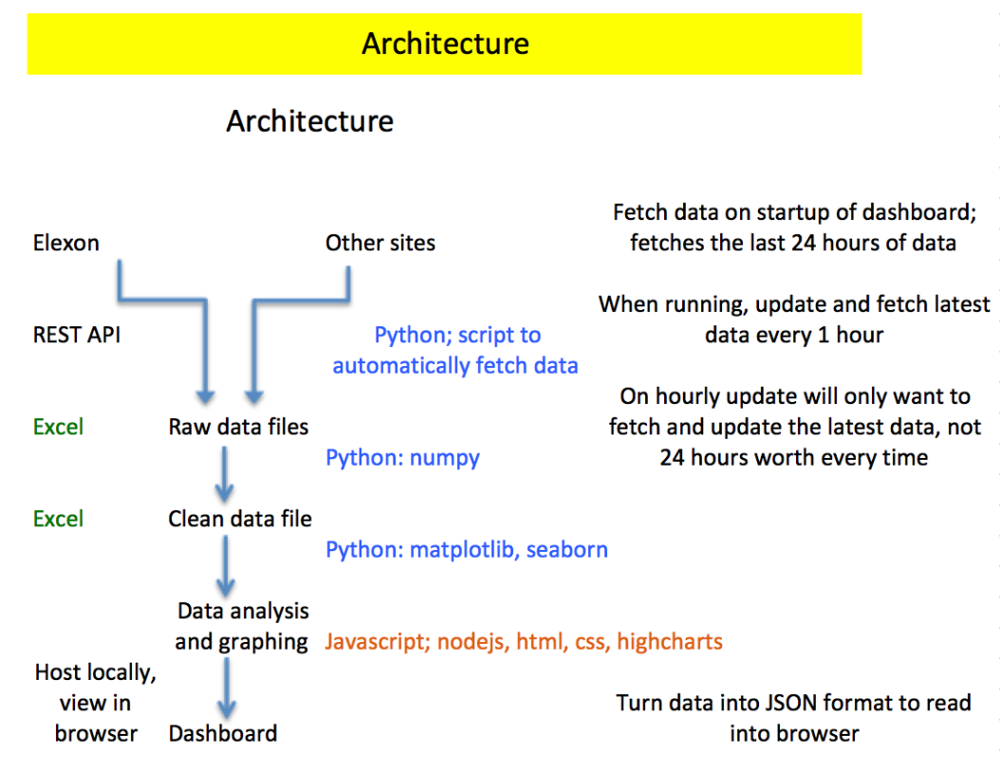

# UK Energy Dashboard
A repository to showcase the code used to create a locally hosted dashboard for the UK energy spot market
[More information](https://medium.com/@rhysshea/my-first-solo-programming-project-db1f6c183c39)

## Purpose
A simple project to build from the ground up and put to practice my recently acquired knowledge of Python and JavaScript into a practical example.

I also wanted to work on something that I have a personal interest in and that I could showcase using data.

## Technologies used
1. Python
  - http-server [path] [options] for locally hosting the dashboard
  - pandas and numpy for data cleaning
  - httplib for interacting with several site APIs and collecting data
  - BeautifulSoup for data parsing
2. JavaScript
  - JS was used to serve up the cleaned data to a webpage that could be modified using HTML and CSS
  - highcharts a graphical JS library that creates interactive graphs

